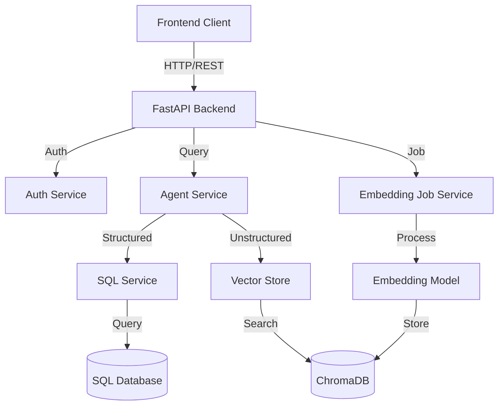
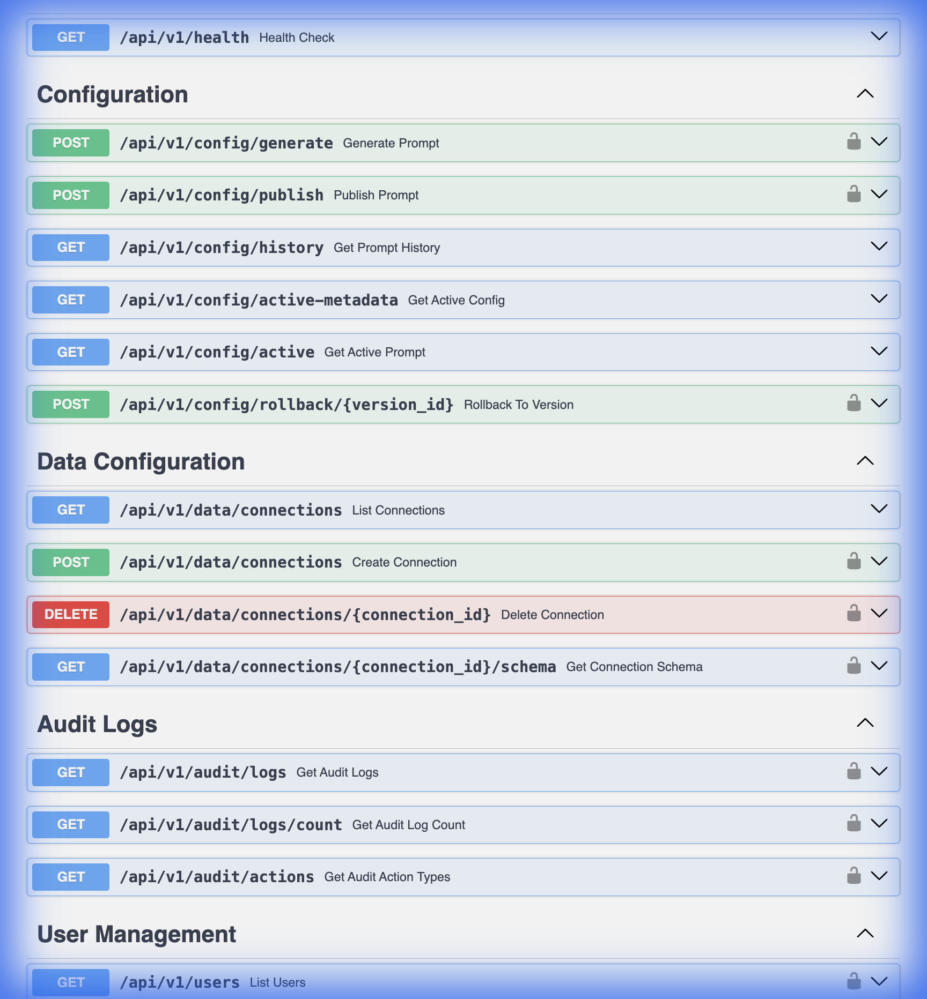

# Backend Documentation

This wiki provides comprehensive documentation for the backend of the Data Insights Copilot, covering architecture, setup, core services, database schema, and API reference.

## 1. System Overview

The backend is built using **FastAPI** and serves as the central orchestration layer for the RAG (Retrieval-Augmented Generation) Chatbot. It integrates structured data (SQL) and unstructured data (Vector Search) to provide intelligent answers to user queries.

### Key Technologies
- **Framework**: FastAPI (Python 3.10+)
- **Database**: SQLite (Production/Dev), PostgreSQL (Supported)
- **ORM/Querying**: Raw SQL with `sqlite3`, SQLAlchemy for introspection
- **AI/LLM**: LangChain, OpenAI (GPT-4o/GPT-3.5-turbo)
- **Vector Store**: ChromaDB (Local)
- **Authentication**: OAuth2 with Password (Bearer Token)
- **Documentation**: Swagger UI / ReDoc

### Architecture Diagram



## 2. Getting Started

### Prerequisites
- Python 3.10 or higher
- Node.js (for frontend, if running full stack)
- OpenAI API Key

### Environment Setup

1.  **Navigate to backend directory**:
    ```bash
    cd backend
    ```

2.  **Create Virtual Environment**:
    ```bash
    python -m venv venv
    source venv/bin/activate  # Linux/Mac
    # or
    .\venv\Scripts\activate  # Windows
    ```

3.  **Install Dependencies**:
    ```bash
    pip install -r requirements.txt
    ```

4.  **Configuration**:
    Copy `.env.example` to `.env` and configure your keys.
    ```bash
    cp .env.example .env
    ```
    
    **Essential `.env` variables**:
    - `OPENAI_API_KEY`: Your OpenAI API key.
    - `SECRET_KEY`: Secret string for JWT token generation.
    - `DATABASE_URL`: Connection string (default: `sqlite:///./sqliteDb/app.db`).

5.  **Run Development Server**:
    ```bash
    ./run_dev.sh
    # or direclty:
    uvicorn app:app --reload --host 0.0.0.0 --port 8000
    ```

## 3. Core Services

The backend logic is distributed across specialized services in the `services/` directory.

### 3.1 Agent Service (`agent_service.py`)
The central brain of the application. It determines whether to use SQL (structured data) or RAG (unstructured text) to answer a user's question.

-   **Routing Logic**:
    -   **Structured Queries**: "How many patients...", "Average age...", "Sales by region..." -> Routes to `SQLService`.
    -   **Unstructured Queries**: "Summarize the report...", "What does the policy say about..." -> Routes to `VectorStore`.
-   **Conversation Memory**: Manages session history to support follow-up questions.
-   **Tools**:
    -   `sql_query_tool`: Generates and executes SQL.
    -   `rag_document_search_tool`: Searches semantic vector index.

### 3.2 SQL Service (`sql_service.py`)
Handles all interaction with the SQL database. It uses a sophisticated "Reflection" loop to maximize query accuracy.

-   **Workflow**:
    1.  **Schema Selection**: Identifies relevant tables based on the user's question to reduce token usage and confusion.
    2.  **SQL Generation**: Uses an LLM to generate a SQL query compatible with the target dialect (SQLite/Postgres).
    3.  **Self-Correction (Reflection)**:
        -   The generated SQL is critiqued by a secondary LLM call.
        -   If syntax errors or logical flaws are found, it auto-corrects before execution.
        -   Retries up to 3 times.
    4.  **Safety**: Validates queries to prevent destructive actions (DROP, DELETE, UPDATE).
    5.  **Execution**: Runs the query and returns results.
    6.  **Formatting**: Converts the raw dataset into a natural language response and generates a JSON configuration for frontend charts.

### 3.3 Embedding Job Service (`embedding_job_service.py`)
Manages the asynchronous long-running background jobs for processing documents and generating embeddings.

-   **State Machine**:
    `QUEUED` -> `PREPARING` -> `EMBEDDING` -> `VALIDATING` -> `STORING` -> `COMPLETED`
-   **Features**:
    -   **Progress Tracking**: Real-time updates on processed batches, estimated time remaining (ETA), and speed (docs/sec).
    -   **Resiliency**: Handles failures at the batch level.
    -   **Concurrency**: Controls thread pool size for optimal embedding generation speed without overloading the API.

### 3.4 Database Service (`sqliteDb/db.py`)
A Singleton service handling core database operations for the application itself (User management, etc.).

-   **User Management**: Registration, Login, Password Hashing (bcrypt).
-   **Configuration Management**: Storing and retrieving RAG configurations and System Prompts.
-   **Connection Management**: Managing external database strings (Connections to external Postgres/MySQL DBs).

## 4. Database Schema

The backend uses a local SQLite database (`app.db`) for application state. Key tables include:

-   **`users`**:
    -   `id`, `username`, `password_hash`, `role` (admin/editor/viewer).
-   **`system_prompts`**:
    -   Stores versioned history of the System Prompt used by the Agent.
    -   Allows "Time Travel" to previous prompt versions.
-   **`prompt_configs`**:
    -   Links a System Prompt version to specific settings (Schema selection, data dictionary).
-   **`embedding_jobs`**:
    -   Tracks status and progress of ingestion jobs.
-   **`db_connections`**:
    -   Stores connection strings for external databases that the Agent can query.

## 5. API Reference

The API is versioned (currently `v1`) and organized by resource.

**Base URL**: `http://localhost:8000/api/v1`

### Documentation
Interactive API documentation is available at `/docs` (Swagger UI) and `/redoc`.


### Key Endpoints

#### Authentication (`/auth`)
-   `POST /auth/login`: Obtain JWT access token.
-   `POST /auth/refresh`: Refresh expired token.
-   `GET /auth/me`: Get current user details.

#### Chat (`/chat`)
-   `POST /chat/message`: Send a message to the agent.
    -   Input: `{ "message": "Show me sales by region", "session_id": "..." }`
    -   Output: JSON containing `answer`, `chart_data`, and `sources`.

#### Data Configuration (`/data`)
-   `GET /data/connections`: List all database connections.
-   `POST /data/connection`: Add a new database source.
-   `GET /data/schema`: Explore tables and columns of a connection.



#### Embedding Jobs (`/embedding/jobs`)
-   `POST /embedding/jobs`: Start a new ingestion job.
-   `GET /embedding/jobs/{job_id}`: Check status/progress.
-   `POST /embedding/jobs/{job_id}/cancel`: Stop a job.


#### System Settings (`/settings`)
-   `GET /settings/prompts`: Get history of system prompts.
-   `POST /settings/prompts`: Publish a new system prompt version.


## 6. Development & Testing

### Running Tests
The project uses `pytest` for testing.

```bash
# Run all tests
pytest

# Run specific test file
pytest tests/test_sql_service.py
```

### Logging
Logs are written to `logs/backend.log` (if configured) and standard output.
Log level can be controlled via `LOG_LEVEL` in `.env`.

## 7. Troubleshooting

### Common Issues

1.  **"Database Locked"**:
    -   SQLite allows only one writer at a time. Ensure no other heavy processes are locking `app.db`.
    
2.  **OpenAI Rate Limits**:
    -   Check `OPENAI_API_KEY` in `.env`.
    -   If rate limited, the Agent will degrade gracefully but may fail on complex queries.

3.  **Missing Tables in Chat**:
    -   Ensure the Schema has been "Refreshed" in the Data Settings.
    -   Check if the tables are excluded in `SQLService` (e.g., demo tables).

