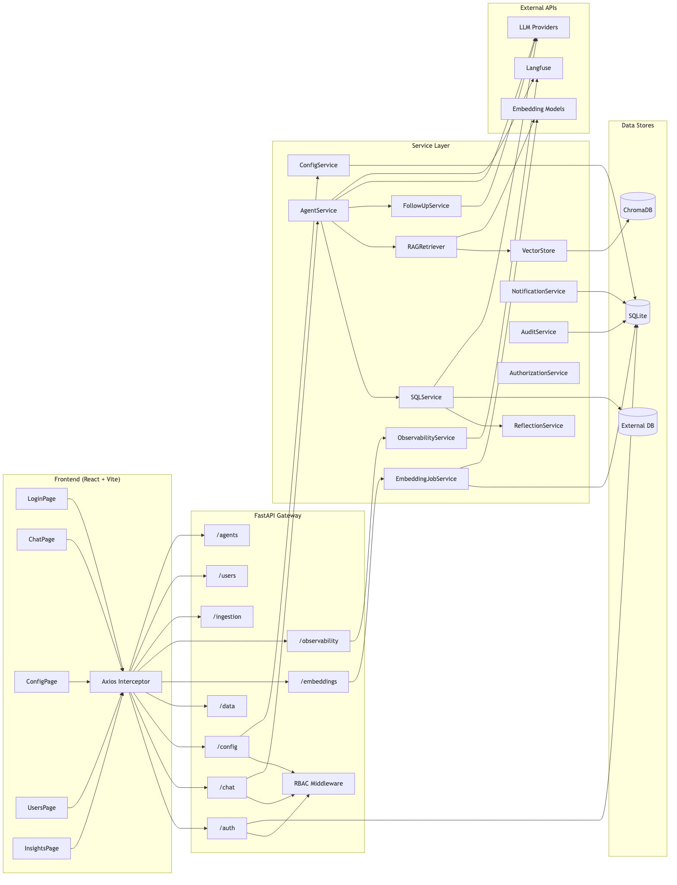
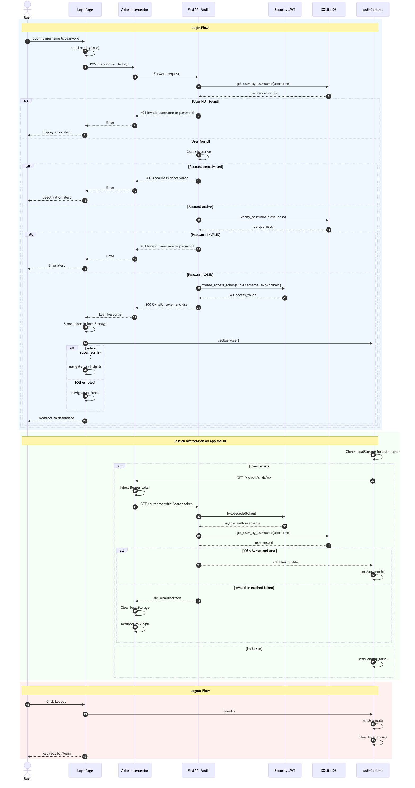
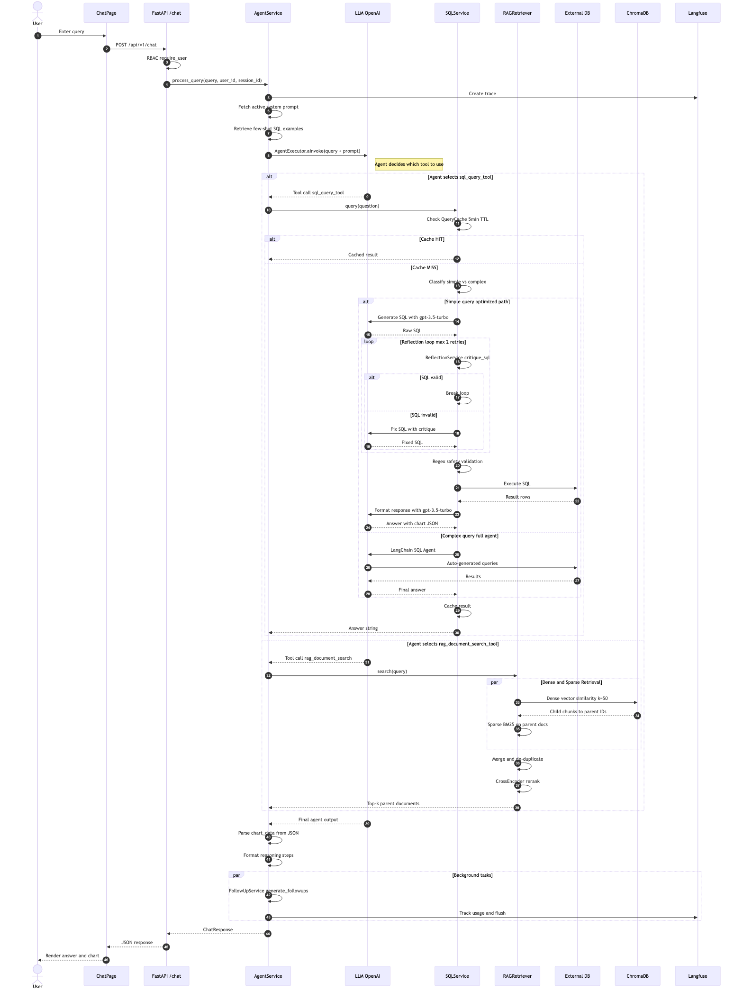
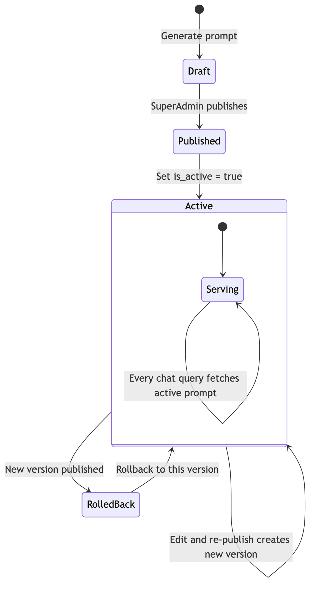
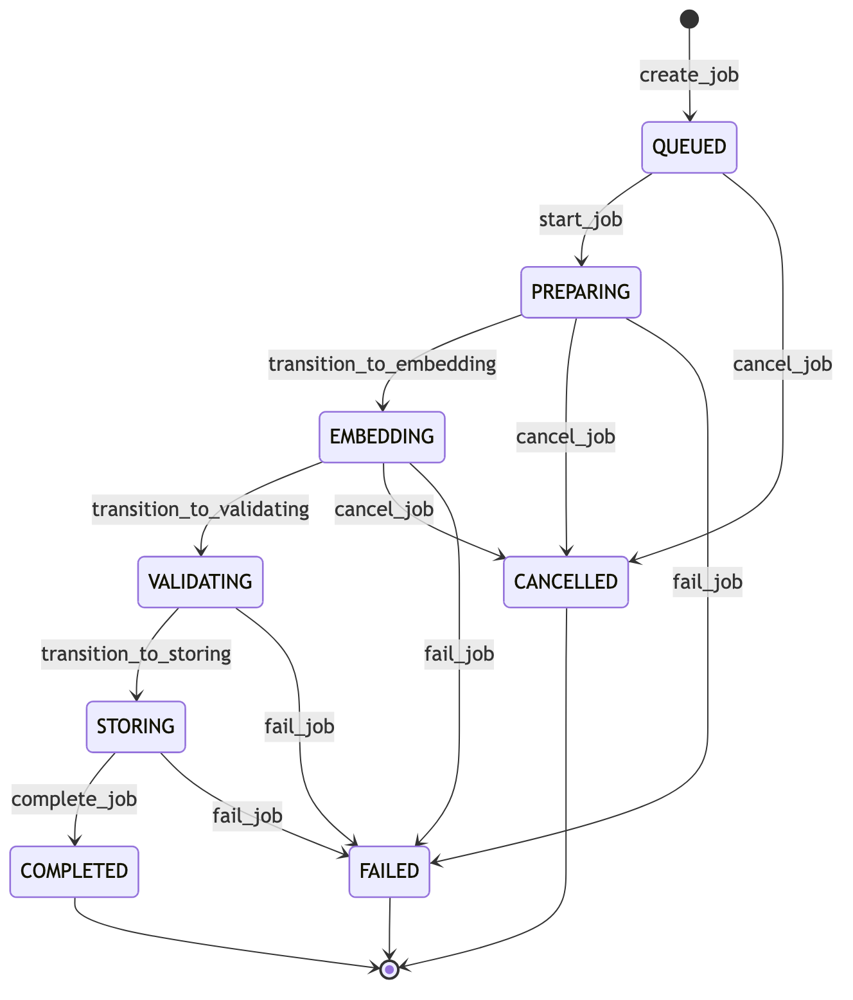
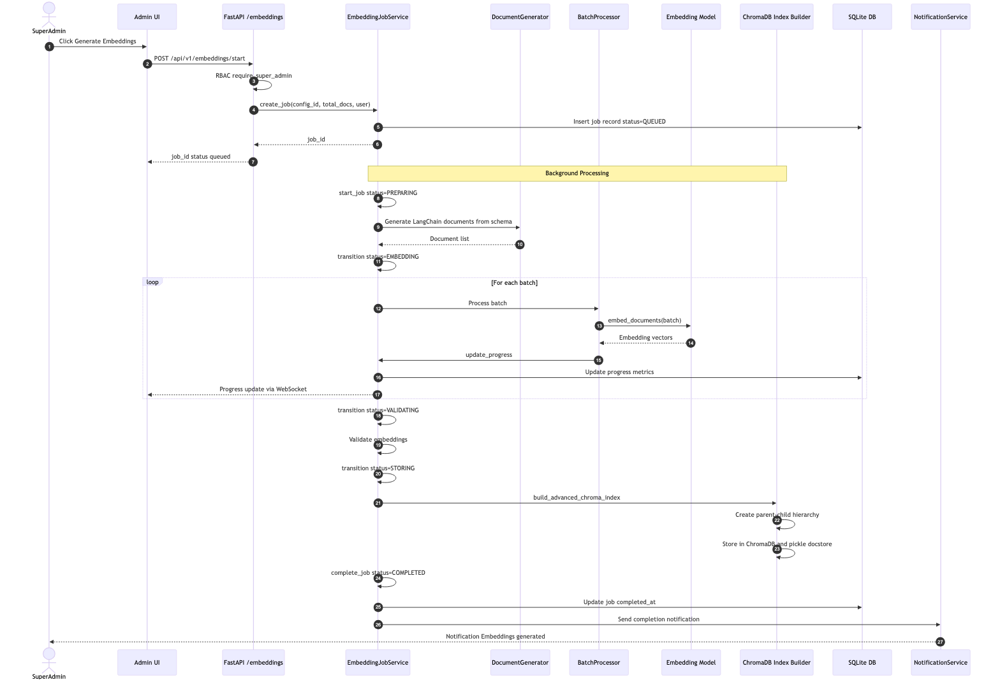
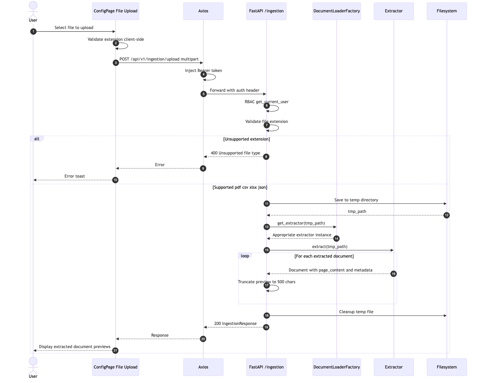
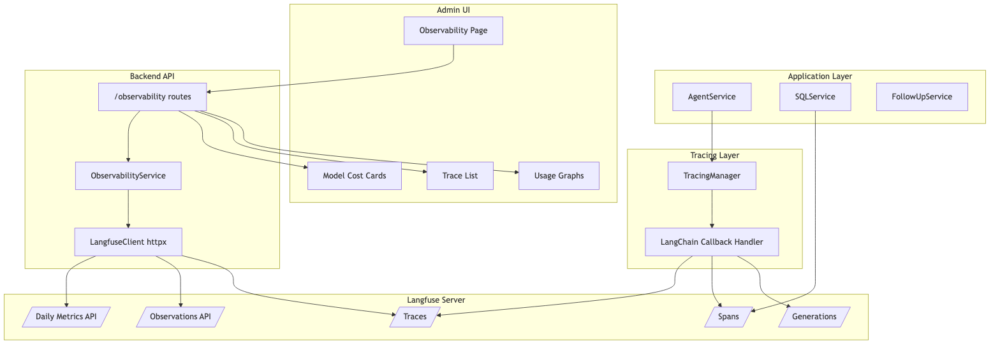
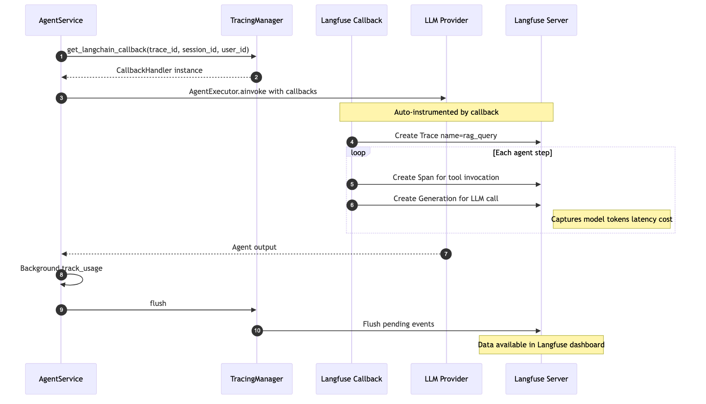

# Architecture Diagrams

Comprehensive system diagrams for every major flow in the **Data Insights Copilot**.

> The Mermaid source files (`.mmd`) are available in [`images/diagrams/`](images/diagrams/) if you need to edit and re-render them.

---

## Table of Contents

1. [High-Level System Architecture](#1-high-level-system-architecture)
2. [User Authentication Flow](#2-user-authentication-flow)
3. [Chat / RAG Query Pipeline](#3-chat--rag-query-pipeline)
4. [RAG Configuration & Prompt Lifecycle](#4-rag-configuration--prompt-lifecycle)
5. [Embedding Generation Pipeline](#5-embedding-generation-pipeline)
6. [Data Ingestion Flow](#6-data-ingestion-flow)
7. [Observability & Tracing Architecture](#7-observability--tracing-architecture)

---

## 1. High-Level System Architecture

A component-level overview showing how the React frontend, FastAPI backend, service layer, data stores, and external APIs interact.

**Key components:**
- **Frontend**: React + Vite with Axios interceptors for JWT injection
- **Gateway**: FastAPI with RBAC middleware (`permissions.py`)
- **Service Layer**: AgentService (orchestrator), SQLService, RAGRetriever, ConfigService, EmbeddingJobService, etc.
- **Data Stores**: SQLite (users, config, audit), ChromaDB (vector index), External DB (PostgreSQL/MySQL)
- **External APIs**: LLM Providers (OpenAI/Azure), Embedding Models, Langfuse (tracing)

---

## 2. User Authentication Flow

Complete login sequence with alt fragments for invalid credentials, deactivated accounts, role-based redirect, session restoration, and logout.

**Flows covered:**
1. **Login**: User submits credentials → bcrypt verification → JWT creation → role-based redirect (`admin` → `/config`, others → `/chat`)
2. **Session Restore**: On app mount, `AuthContext` checks `localStorage` for token → calls `GET /auth/me` → restores user state
3. **Logout**: Clears `localStorage` and `AuthContext`, redirects to `/login`

**Edge cases:** User not found (401), account deactivated (403), invalid password (401), expired token (401 → clear & redirect)

---

## 3. Chat / RAG Query Pipeline

The core intelligence flow: how a user's natural-language question is routed through the Agent, SQL tool, or RAG tool to produce an answer with charts and follow-up suggestions.

**Key decision points:**
- **Tool selection**: LLM Agent decides between `sql_query_tool` and `rag_document_search_tool`
- **SQL path**: Query cache (5min TTL) → simple/complex classification → optimized path (generate SQL → reflection loop with max 2 retries → execute → format) or full LangChain SQL Agent
- **RAG path**: Hybrid retrieval (dense vector similarity + BM25 sparse) → merge & de-duplicate → CrossEncoder rerank → top-k documents
- **Background**: Follow-up question generation (async, 2s timeout) + Langfuse usage tracking

---

## 4. RAG Configuration & Prompt Lifecycle

The admin wizard flow for configuring data sources, generating system prompts, and managing prompt versions.

### 4a. Configuration Wizard Sequence

**3-step wizard:**
1. **Select Data Source**: Choose database connection (fetches schema) or upload file (extracts documents)
2. **Generate Draft Prompt**: LLM generates system prompt from data dictionary/schema context
3. **Review & Publish**: SuperAdmin edits, reviews reasoning, and publishes → becomes active prompt

### 4b. Prompt Version State Diagram

---

## 5. Embedding Generation Pipeline

The embedding job lifecycle with its state machine and batch processing flow.

### 5a. Job State Machine

**States:** `QUEUED` → `PREPARING` → `EMBEDDING` → `VALIDATING` → `STORING` → `COMPLETED` (or `FAILED` / `CANCELLED`)

### 5b. Embedding Generation Sequence

**Flow:**
1. SuperAdmin triggers embedding generation
2. Job created in SQLite (status=QUEUED)
3. Background: generate LangChain documents → batch processing → embed with model → build ChromaDB index
4. Real-time progress via WebSocket
5. Completion notification sent

---

## 6. Data Ingestion Flow

File upload → extraction → preview pipeline for multi-modal document ingestion.

**Supported formats:** `.pdf`, `.csv`, `.xlsx`, `.json`

**Flow:** Upload → validate extension → save to temp → `DocumentLoaderFactory` selects extractor → extract documents → truncate previews (500 chars, max 50 docs) → cleanup temp → return response

---

## 7. Observability & Tracing Architecture

How the system tracks LLM usage, costs, and latency through Langfuse integration and surfaces metrics in the admin UI.

### 7a. Tracing Component Architecture

### 7b. Query Tracing Sequence

**How tracing works:**
1. `AgentService` creates a LangChain callback handler via `TracingManager`
2. Callback auto-instruments all agent steps as Langfuse Traces → Spans → Generations
3. Each LLM call captures: model name, token counts, latency, cost, input/output
4. `ObservabilityService` fetches aggregated metrics from Langfuse API via `httpx`. Admin UI displays cost cards, trace lists, and usage graphs in the Config page

---

## Cross-Reference to Wiki Pages

| Diagram | Related Wiki Page |
|---------|-------------------|
| System Architecture | [Backend Architecture](Backend.md) |
| Authentication Flow | [RBAC](RBAC.md), [API Reference](API.md) |
| Chat / RAG Pipeline | [Backend Architecture](Backend.md), [Charts](Charts.md) |
| Prompt Lifecycle | [Backend Architecture](Backend.md) |
| Embedding Pipeline | [Backend Architecture](Backend.md) |
| Data Ingestion | [Backend Architecture](Backend.md) |
| Observability | [Observability & Tracing](Observability.md) |
