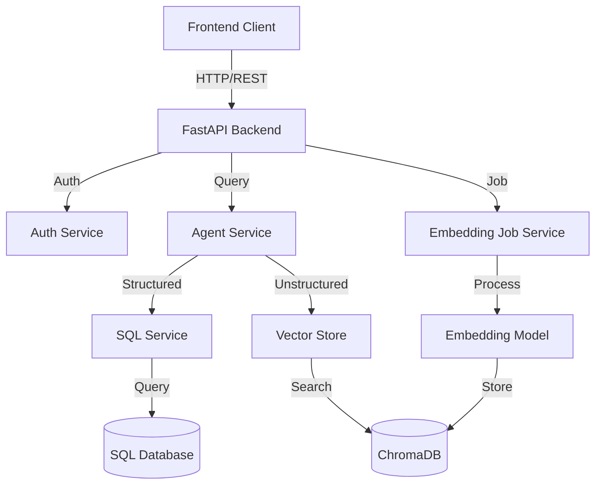
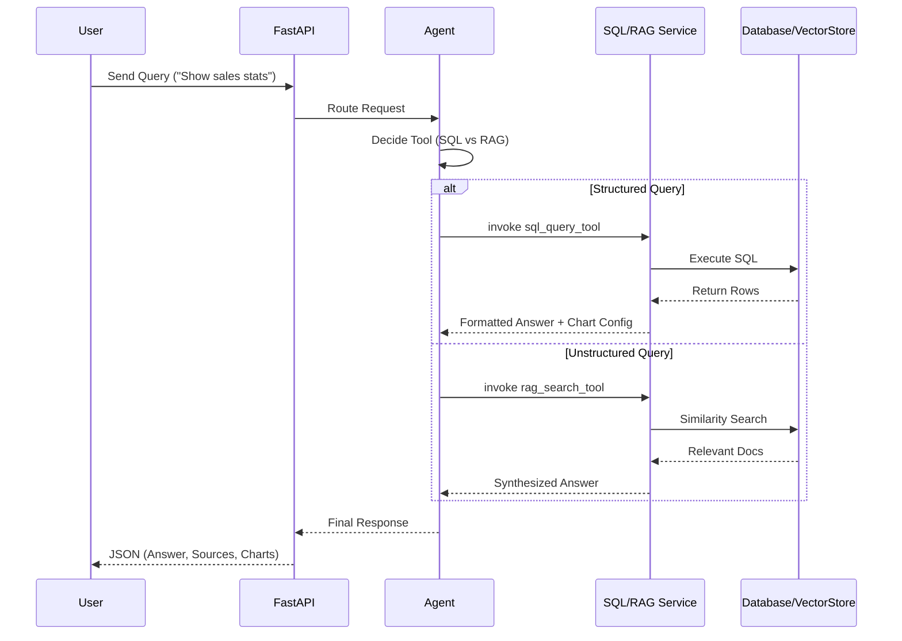
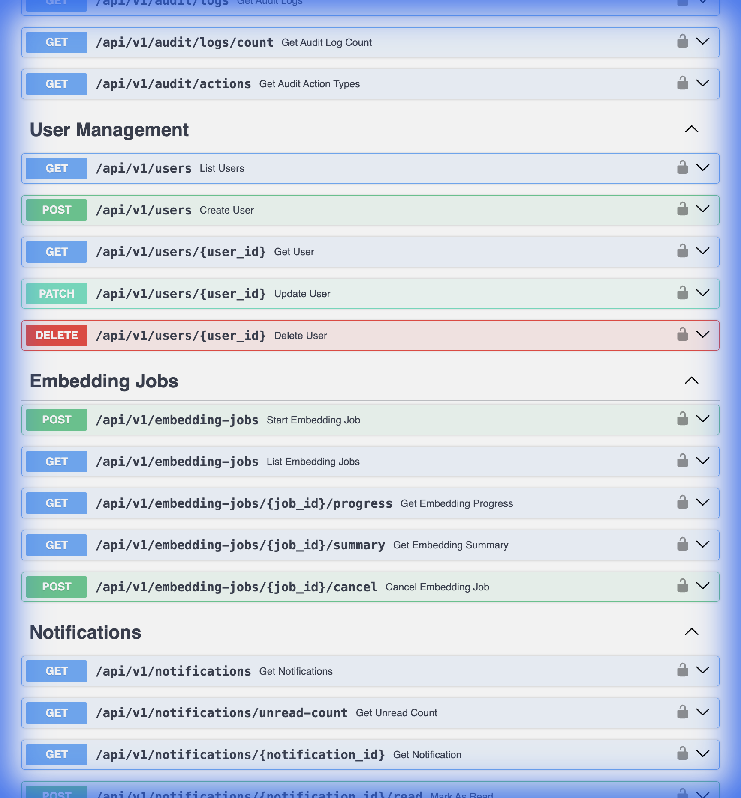

# Backend Documentation

This wiki provides comprehensive documentation for the backend of the Data Insights Copilot, covering architecture, setup, core services, database schema, and API reference.

## 1. System Overview

The backend is built using **FastAPI** and serves as the central orchestration layer for the RAG (Retrieval-Augmented Generation) Chatbot. It integrates structured data (SQL) and unstructured data (Vector Search) to provide intelligent answers to user queries.

### Key Technologies
- **Framework**: FastAPI (Python 3.10+)
- **Database**: SQLite (Production/Dev), PostgreSQL (Supported)
- **ORM/Querying**: Raw SQL with `sqlite3`, SQLAlchemy for introspection
- **AI/LLM**: LangChain, OpenAI (GPT-4o/GPT-3.5-turbo)
- **Vector Store**: ChromaDB (Local)
- **Authentication**: OAuth2 with Password (Bearer Token)
- **Documentation**: Swagger UI / ReDoc

### Architecture Diagram



### Project Structure (Backend)

```bash
backend/
├── api/                # API Routes & Dependencies
│   └── routes/         # Endpoint definitions (Auth, Chat, Data, etc.)
├── core/               # Core configuration, Logging, Security
├── rag/                # RAG Logic (Retriever, Vector Store init)
├── scripts/            # Standalone utility scripts
├── services/           # Business Logic (The "Brain")
│   ├── agent_service.py        # Orchestrator
│   ├── sql_service.py          # Structured Data
│   └── embedding_service.py    # Unstructured Data
├── sqliteDb/           # Database setup & Migrations
└── app.py              # Main application entrypoint
```

### Data Flow



## 2. Getting Started

### Prerequisites
- Python 3.10 or higher
- Node.js (for frontend, if running full stack)
- OpenAI API Key

### Environment Setup

1.  **Navigate to backend directory**:
    ```bash
    cd backend
    ```

2.  **Create Virtual Environment**:
    ```bash
    python -m venv venv
    source venv/bin/activate  # Linux/Mac
    # or
    .\venv\Scripts\activate  # Windows
    ```

3.  **Install Dependencies**:
    ```bash
    pip install -r requirements.txt
    ```

4.  **Configuration**:
    Copy `.env.example` to `.env` and configure your keys.
    ```bash
    cp .env.example .env
    ```
    
    **Essential `.env` variables**:
    - `OPENAI_API_KEY`: Your OpenAI API key.
    - `SECRET_KEY`: Secret string for JWT token generation.
    - `DATABASE_URL`: Connection string (default: `sqlite:///./sqliteDb/app.db`).

    ./run_dev.sh
    # or direclty:
    uvicorn app:app --reload --host 0.0.0.0 --port 8000
    ```

6.  **Login**:
    -   **URL**: `http://localhost:3000/login`
    -   **Default Admin**: `admin` / `admin123`
    -   *Change this password immediately after logging in.*

## 3. Core Services

The backend logic is distributed across specialized services in the `services/` directory.

### 3.1 Agent Service (`agent_service.py`)
The central brain of the application. It determines whether to use SQL (structured data) or RAG (unstructured text) to answer a user's question.

-   **Routing Logic**:
    -   **Structured Queries**: "How many patients...", "Average age...", "Sales by region..." -> Routes to `SQLService`.
    -   **Unstructured Queries**: "Summarize the report...", "What does the policy say about..." -> Routes to `VectorStore`.
-   **Conversation Memory**: Manages session history to support follow-up questions.
-   **Tools**:
    -   `sql_query_tool`: Generates and executes SQL.
### 3.5 Authorization Service (`authorization_service.py`)
Centralized permissions and access control. 
- **Features**: Role-based access control (RBAC), audit logging for sensitive actions.

### 3.6 Audit Service (`audit_service.py`)
Tracks system-wide events for security and compliance.
- **Features**: Structured logging, filtering by user/action/resource.

### 3.7 Follow-up Service (`followup_service.py`)
Generates context-aware suggested questions for the chat interface.
- **Features**: Uses LLM to predict next logical user queries.

### 3.8 Reflection Service (`reflection_service.py`)
The "Critic" in the SQL generation pipeline.
- **Features**: Validates generated SQL, checks for hallucinations, and suggests fixes.

### 3.9 Embedding Document Generator (`embedding_document_generator.py`)
Prepares data for vectorization.
- **Features**: Converts database rows into rich text documents for semantic search.


### 3.2 SQL Service (`sql_service.py`)
Handles all interaction with the SQL database. It uses a sophisticated "Reflection" loop to maximize query accuracy.

-   **Workflow**:
    1.  **Schema Selection**: Identifies relevant tables based on the user's question to reduce token usage and confusion.
    2.  **SQL Generation**: Uses an LLM to generate a SQL query compatible with the target dialect (SQLite/Postgres).
    3.  **Self-Correction (Reflection)**:
        -   The generated SQL is critiqued by a secondary LLM call.
        -   If syntax errors or logical flaws are found, it auto-corrects before execution.
        -   Retries up to 3 times.
    4.  **Safety**: Validates queries to prevent destructive actions (DROP, DELETE, UPDATE).
    5.  **Execution**: Runs the query and returns results.
    6.  **Formatting**: Converts the raw dataset into a natural language response and generates a JSON configuration for frontend charts.

### 3.3 Embedding Job Service (`embedding_job_service.py`)
Manages the asynchronous long-running background jobs for processing documents and generating embeddings.

-   **State Machine**:
    `QUEUED` -> `PREPARING` -> `EMBEDDING` -> `VALIDATING` -> `STORING` -> `COMPLETED`
-   **Features**:
    -   **Progress Tracking**: Real-time updates on processed batches, estimated time remaining (ETA), and speed (docs/sec).
    -   **Resiliency**: Handles failures at the batch level.
    -   **Concurrency**: Controls thread pool size for optimal embedding generation speed without overloading the API.

### 3.4 Database Service (`sqliteDb/db.py`)
A Singleton service handling core database operations for the application itself (User management, etc.).

-   **User Management**: Registration, Login, Password Hashing (bcrypt).
-   **Configuration Management**: Storing and retrieving RAG configurations and System Prompts.
### 3.10 Config Service (`config_service.py`)
Provides access to system configuration.
- **Features**: Loads environment variables, manages secrets, and provides typed configuration objects.

## 4. Embedding System

The backend features a pluggable embedding architecture (`embedding_providers.py` & `embedding_registry.py`).

### Supported Providers
- **BGE-M3 (Default)**: Runs locally using `SentenceTransformers`. Optimized for multilingual retrieval.
- **OpenAI**: Uses `text-embedding-3-small` or `large`. Requires API key.
- **Generic HuggingFace**: Load any compatible model (e.g., `all-MiniLM-L6-v2`).

## 5. LLM System

The backend features a pluggable LLM architecture (`llm_providers.py` & `llm_registry.py`) enabling runtime switching between providers.

### Supported Providers

| Provider | Description | Requires API Key |
|----------|-------------|------------------|
| **OpenAI** | GPT-4o, GPT-4, GPT-3.5-turbo | Yes |
| **Azure OpenAI** | Azure-hosted OpenAI deployments | Yes + Endpoint |
| **Anthropic** | Claude 3.5, Claude 3 models | Yes |
| **Ollama** | Local models (Llama, Mistral, etc.) | No |
| **HuggingFace** | API or local inference | Yes (API mode) |
| **Local LLM** | GGUF models via LlamaCpp | No |

### Configuration via API

```bash
# List available providers
GET /api/v1/settings/llm/providers

# Get current configuration
GET /api/v1/settings/llm

# Switch provider (hot-swap)
PUT /api/v1/settings/llm
{
  "provider": "anthropic",
  "config": {
    "model_name": "claude-3-5-sonnet-20241022",
    "api_key": "your-api-key"
  }
}

# Validate credentials without saving
POST /api/v1/settings/llm/validate
```

### Hot-Swapping

The `LLMRegistry` allows changing LLM providers at runtime without restart. Changes are persisted to the database and take effect immediately for all new requests.


## 6. Development Tools

### Gradio Prototype (`backend/scripts/main.py`)
A standalone, interactive UI for testing the RAG pipeline without the full frontend.
- **Run**: `python -m backend.scripts.main`
- **Features**: Chat interface, plot generation, and raw retrieval inspection.
- **Note**: This is a development tool and uses its own agent logic separate from the main FastAPI app.

## 7. Database Schema

The backend uses a local SQLite database (`app.db`).

**[View Detailed Database Schema](Database.md)**

Key tables include:
- `users`: User accounts and roles.
- `system_prompts`: Versioned system prompts.
- `rag_configurations`: RAG pipeline settings.

## 8. API Reference

The API is versioned (currently `v1`).

**[View Full API Reference](API.md)**

**Base URL**: `http://localhost:8000/api/v1`

### Documentation
Interactive API documentation is available at `/docs` (Swagger UI) and `/redoc`.


### Key Endpoints

#### Authentication (`/auth`)
-   `POST /auth/login`: Obtain JWT access token.
-   `POST /auth/refresh`: Refresh expired token.
-   `GET /auth/me`: Get current user details.

#### Chat (`/chat`)
-   `POST /chat/message`: Send a message to the agent.
    -   Input: `{ "message": "Show me sales by region", "session_id": "..." }`
    -   Output: JSON containing `answer`, `chart_data`, and `sources`.

#### Data Configuration (`/data`)
-   `GET /data/connections`: List all database connections.
-   `POST /data/connection`: Add a new database source.
-   `GET /data/schema`: Explore tables and columns of a connection.


#### Embedding Jobs (`/embedding/jobs`)
-   `POST /embedding/jobs`: Start a new ingestion job.
-   `GET /embedding/jobs/{job_id}`: Check status/progress.
-   `POST /embedding/jobs/{job_id}/cancel`: Stop a job.



#### System Settings (`/settings`)
-   `GET /settings/prompts`: Get history of system prompts.
-   `POST /settings/prompts`: Publish a new system prompt version.


## 9. Development & Testing

### Running Tests
The project uses `pytest` for testing.

```bash
# Run all tests
pytest

# Run specific test file
pytest tests/test_sql_service.py
```

### Logging
Logs are written to `logs/backend.log` (if configured) and standard output.
Log level can be controlled via `LOG_LEVEL` in `.env`.

## 10. Troubleshooting

### Common Issues

1.  **"Database Locked"**:
    -   SQLite allows only one writer at a time. Ensure no other heavy processes are locking `app.db`.
    
2.  **OpenAI Rate Limits**:
    -   Check `OPENAI_API_KEY` in `.env`.
    -   If rate limited, the Agent will degrade gracefully but may fail on complex queries.

3.  **Missing Tables in Chat**:
    -   Ensure the Schema has been "Refreshed" in the Data Settings.
    -   Check if the tables are excluded in `SQLService` (e.g., demo tables).

## 11. Observability & Tracing

The backend includes comprehensive observability features for monitoring LLM usage, costs, and performance.

### Langfuse Integration

All LLM calls are automatically traced via [Langfuse](https://langfuse.com):

```python
# Automatic tracing via LLMRegistry
llm = registry.get_langchain_llm(with_tracing=True)  # Attaches Langfuse callback

# Manual decoration for custom operations
from langfuse import observe

@observe(as_type="span")
def my_custom_operation():
    ...
```

### Local Langfuse Setup

```bash
# Start local Langfuse
docker-compose -f docker-compose.langfuse.yml up -d

# Access at http://localhost:3001
```

### Environment Variables

```bash
ENABLE_LANGFUSE=true
LANGFUSE_PUBLIC_KEY=pk-lf-...
LANGFUSE_SECRET_KEY=sk-lf-...
LANGFUSE_HOST=http://localhost:3001
```

### Observability API Endpoints

| Endpoint | Method | Description |
|----------|--------|-------------|
| `/observability/config` | GET | Get current observability settings |
| `/observability/config` | PUT | Update log level, tracing settings |
| `/observability/usage` | GET | Get usage statistics (tokens, costs) |
| `/observability/test-log` | POST | Emit a test log message |

**[View Full Observability Documentation](Observability.md)**

## 12. Related Documentation

- [API Reference](API.md)
- [Database Schema](Database.md)
- [RBAC & Permissions](RBAC.md)
- [Observability & Tracing](Observability.md)
- [Deployment Guide](Deployment.md)
