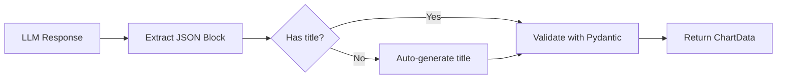

# Chart Generation System

This document explains how the Data Insights Copilot automatically generates visualizations for query results.

## Overview

The system uses an **LLM-powered chart generation pipeline** that:
1. Analyzes query results
2. Selects the appropriate chart type
3. Formats data for frontend rendering
4. Handles edge cases and missing fields

---

## Supported Chart Types

| Chart Type | Use Case | Example Query |
|------------|----------|---------------|
| **Line** | Trends over time | "Show patient enrollment by month" |
| **Bar** | Categorical comparisons | "Compare sales across regions" |
| **Pie** | Simple proportions (2-5 categories) | "Gender distribution" |
| **Treemap** | Location/hierarchical distributions | "Patients by district" |
| **Radar** | Multi-metric entity comparisons | "Compare Hospital A vs B across 5 KPIs" |
| **Scorecard** | Single statistics/KPIs | "Total active patients" |

---

## Chart Generation Rules

The system follows these rules (embedded in every system prompt):

```
CHART GENERATION RULES:
1. Generate a chart_json for every query that returns data.
2. Use 'treemap' for distributions by location (e.g., country, site).
3. Use 'radar' for comparing entities across multiple metrics.
4. Use 'scorecard' for single statistics or summary data.
5. Use 'line' for trends over time (e.g., monthly/yearly data).
6. Use 'bar' for categorical comparisons or rankings.
7. Use 'pie' for simple proportions (2-5 categories).
8. Do not use 'bar' or 'pie' for location distributions; use 'treemap' instead.
```

---

## JSON Format

The LLM generates chart data in this format:

```json
{
  "title": "Patient Enrollment Trend",
  "type": "line",
  "data": {
    "labels": ["Jan", "Feb", "Mar"],
    "values": [10, 20, 15]
  }
}
```

### Required Fields
- `title`: Chart title (auto-generated if missing)
- `type`: One of: `line`, `bar`, `pie`, `treemap`, `radar`, `scorecard`
- `data`: Object containing `labels` and `values` arrays

> **Note**: The system uses a simple `labels`/`values` format, NOT Chart.js `datasets` structure.

---

## Configuration Wizard Integration

### How It Works

When you create a new configuration via the **Setup Wizard**:

1. **Connect Database** → Select your data source
2. **Select Schema** → Choose tables/columns
3. **Add Data Dictionary** → Provide context
4. **Generate Prompt** → LLM creates domain-specific prompt
5. **Auto-Append Chart Rules** ✨ → `ConfigService` automatically adds standard chart rules
6. **Review & Publish** → You see the full prompt with chart support

### Code Reference

File: [`backend/services/config_service.py`](file:///Users/adityanbhatt/Documents/Data-inisights-copilot/backend/services/config_service.py)

```python
# Standard Chart Rules (appended to every generated prompt)
standard_chart_rules = """
CHART GENERATION RULES:
1. Generate a chart_json for every query that returns data.
2. Use 'treemap' for distributions by location...
...
"""

# After LLM generates domain prompt
prompt_content += "\n\n" + standard_chart_rules
```

This ensures **every configuration** has full chart support, regardless of the domain.

---

## Backend Processing

### Agent Service Flow

File: [`backend/services/agent_service.py`](file:///Users/adityanbhatt/Documents/Data-inisights-copilot/backend/services/agent_service.py)



### Fallback Mechanisms

1. **Missing Title**: Auto-generates title (e.g., "Line Visualization")
2. **Chart.js Format**: Transforms `datasets` → `values` array
3. **Parsing Errors**: Logs warning, returns `null` (graceful degradation)

---

## Frontend Rendering

File: [`frontend/src/components/chat/ChartRenderer.tsx`](file:///Users/adityanbhatt/Documents/Data-inisights-copilot/frontend/src/components/chat/ChartRenderer.tsx)

The frontend uses **Recharts** library to render charts. It expects data in this format:

```typescript
{
  title: string;
  type: "line" | "bar" | "pie" | "treemap" | "radar" | "scorecard";
  data: {
    labels: string[];
    values: number[];
  }
}
```

---

## Troubleshooting

### Chart Not Rendering (`chart_data: null`)

**Possible Causes:**
1. LLM didn't generate JSON block
2. JSON is malformed
3. Missing required fields

**Debug Steps:**
1. Check `/tmp/llm_response_debug.txt` for raw LLM output
2. Look for backend logs: `backend/logs/backend.log`
3. Verify active prompt has chart rules:
   ```bash
   sqlite3 backend/sqliteDb/app.db "SELECT prompt_text FROM system_prompts WHERE is_active = 1"
   ```

### Wrong Chart Type

**Solution:** Update the system prompt to emphasize the correct type for your use case.

Example:
```
For inventory queries, ALWAYS use 'bar' charts, never 'pie'.
```

---

## Best Practices

1. **Domain-Specific Rules**: Add custom chart preferences to your prompt
   - E.g., "For financial data, use 'line' charts for time series"
2. **Test Queries**: Verify chart generation with sample queries after publishing
3. **Prompt Clarity**: Be explicit about when to generate charts vs. text-only responses

---

## API Response Format

The `/api/v1/chat` endpoint returns:

```json
{
  "answer": "Here are the results...",
  "chart_data": {
    "title": "...",
    "type": "...",
    "data": {...}
  },
  "suggested_questions": [...],
  "reasoning_steps": [...]
}
```

If no chart is generated, `chart_data` will be `null`.

---

## Related Documentation

- [Backend Architecture](Backend.md)
- [API Reference](API.md)
- [Frontend Components](Frontend.md)
