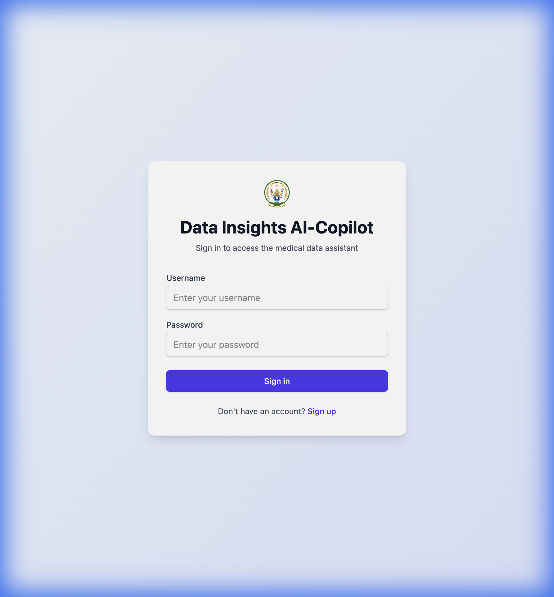
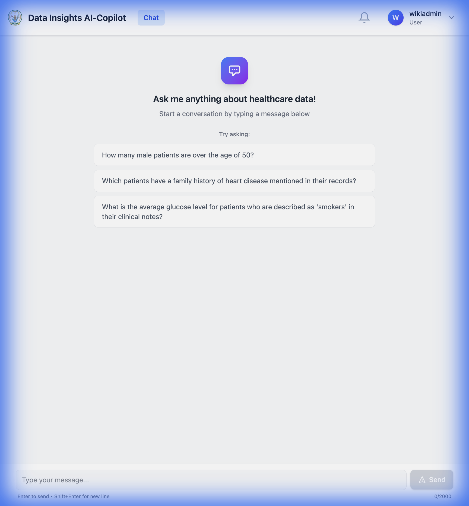

# Data Insights Copilot Wiki

Welcome to the official documentation for the **Data Insights Copilot**.

## Project Overview

Data Insights Copilot is an advanced RAG (Retrieval-Augmented Generation) chatbot designed to help users query and visualize data from both structured SQL databases and unstructured documents.

### Key Features
- **Hybrid Search**: Seamlessly routes queries between SQL generation and Vector Search (RAG).
- **Interactive Visualizations**: Automatically generates charts (Bar, Pie, Line) based on data.
- **Dynamic Configuration**: Supports connecting to external databases and managing system prompts.
- **Admin Dashboard**: Comprehensive tools for user management, audit logging, and system monitoring.

## Quick Start

1.  **Clone & Run**: `docker-compose up -d`
2.  **Access UI**: [http://localhost:3000](http://localhost:3000)
    
    

3.  **Default Login**: `admin` / `admin123`

    

## Documentation Sections

- **[Backend Architecture](Backend.md)**
    - [API Reference](API.md), [Database Schema](Database.md), [RBAC](RBAC.md), Services.
- **[Frontend Guide](Frontend.md)**
    - Component Structure, State Management, UI/UX Guidelines.
- **[Deployment & Setup](Deployment.md)**
    - Installation, Environment Configuration, Production Deployment.
- **[Troubleshooting](Troubleshooting.md)**
    - Common issues, Debugging workflows, FAQs.

## Quick Links

- [GitHub Repository](https://github.com/mdt-smartcare/Data-inisights-copilot)
- [API Documentation (Local)](http://localhost:8000/api/v1/docs)
